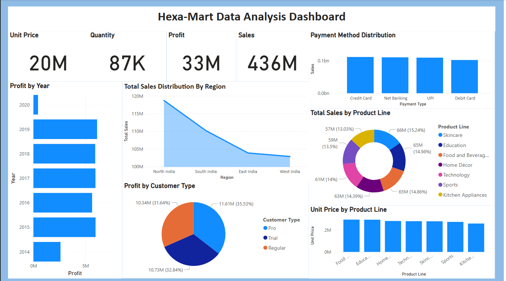

📊 Hexa-Mart Sales Data Analytics Dashboard - Power BI

Welcome to the Hexa-Mart Data Analysis Dashboard repository!
This project was built as part of a Data Analytics Competition where the goal was to analyze a complex retail sales dataset and derive insights through a visual, interactive dashboard using Power BI.

  

🚀 Project Overview
This dashboard presents a comprehensive analysis of Hexa-Mart's sales performance, covering multiple dimensions such as:

Unit Price, Quantity Sold, Profit, and Sales

Year-wise Profit Trends

Region-wise Sales Distribution

Customer Type Profit Contribution

Payment Method Distribution

Sales & Unit Prices by Product Line

The dashboard helps stakeholders quickly identify profitable segments, regional sales strengths, and patterns in customer behavior.

📂 Features
📅 Yearly Profit Trends – Visualized using horizontal bar charts

🌍 Sales by Region – Comparative analysis of North, South, East, and West India

🧑‍🤝‍🧑 Customer Segmentation – Profit generated by Pro, Trial, and Regular customers

💳 Payment Insights – Distribution across Credit Card, Net Banking, UPI, and Debit Card

🛒 Product Line Analysis – Deep dive into categories like Skincare, Education, Food & Beverages, and more

💰 Unit Price Trends – Easily track pricing strategies across product lines

📈 Tools Used
Power BI Desktop

DAX (Data Analysis Expressions)

Data Transformation using Power Query

CSV/Excel Dataset (Competition Provided)

🏁 How to Use
Clone this repository:

bash
Copy
Edit
git clone https://github.com/your-username/hexa-mart-powerbi-dashboard.git
Open the .pbix file in Power BI Desktop

Refresh the data (if source is linked) or import your own dataset

Explore and interact with the visualizations!

📝 Learnings
Hands-on experience with data cleaning, transformation, and modeling

Designing intuitive and impactful dashboards

Extracting business insights from multidimensional data

Building KPI cards and dynamic filters

📌 Use Case
This dashboard can be leveraged by:

Retail business analysts

Marketing and sales strategy teams

Data science students practicing data visualization

Companies aiming to understand product and customer performance
